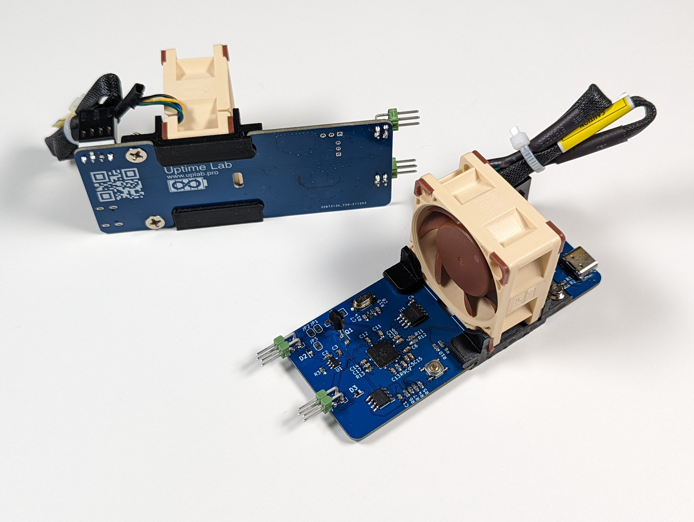
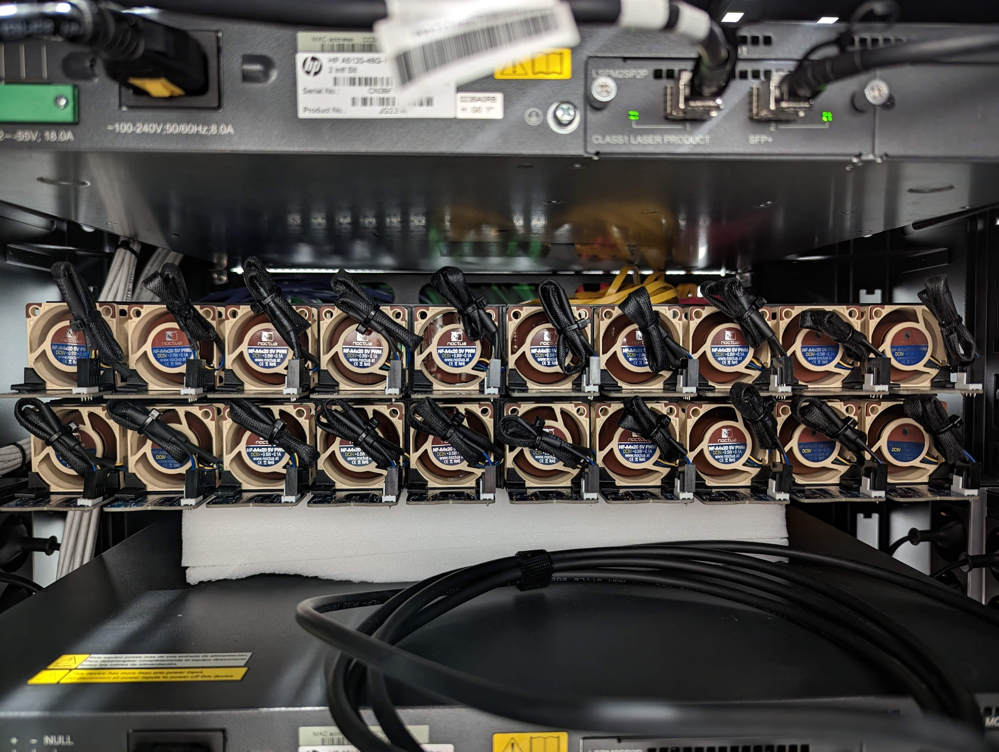
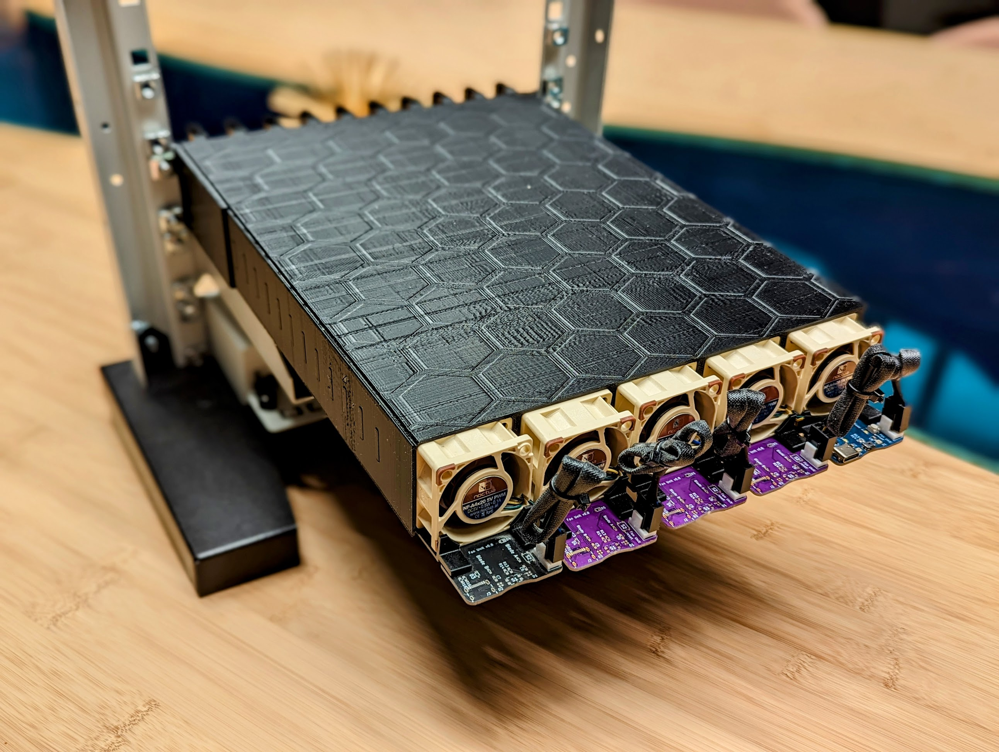
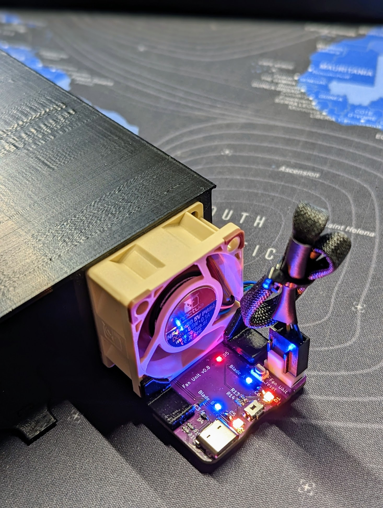
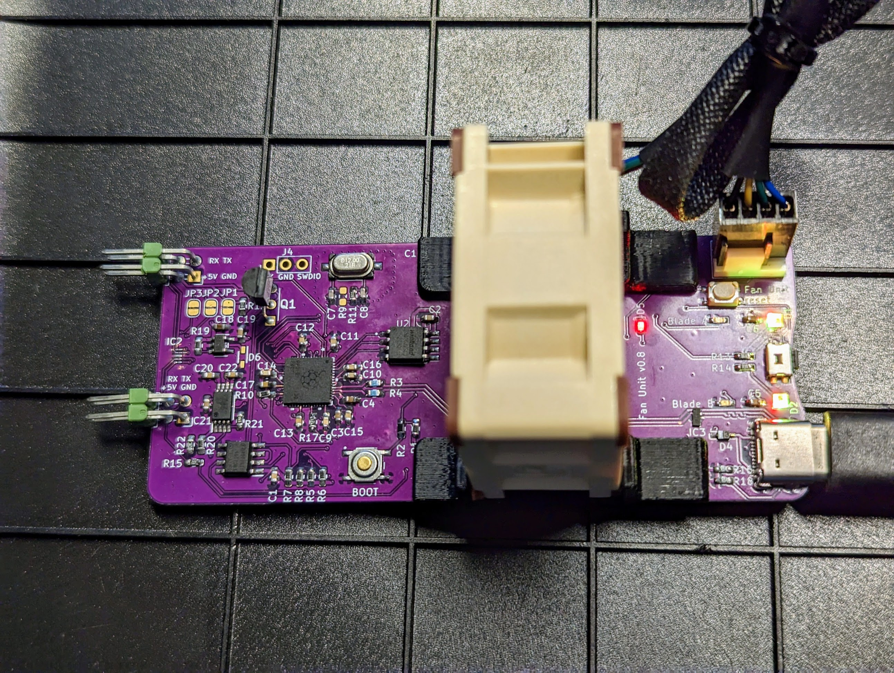

 

  <h3 align="center">Compute Blade Fan Unit</h3>

  

    When just a fan is ... boring
     
     
  

     

## About The Project

**The main purpose is to cool Compute Blade installed in the enclosure.**\
Requires 1 Fan Unit per 2 Blades. That is, up to 10 Fan Units per 19" enclosure.

There were many iterations.There are two versions left in the final:
* Smart Fan Unit, based on [Raspberry Pi RP2040](https://www.raspberrypi.com/documentation/microcontrollers/rp2040.html) and [EMC2101](https://www.microchip.com/en-us/product/EMC2101)
* not Smart Fan Unit (or just Dumb Fan Unit)

## Dumb Fan Unit Features

* Isolated powering from both blades at the same time, control from the left in the pair. 
* It is possible to control the speed of fan rotation and get the current speed (RPM). As with any 4-pin PWM Fan.

## Smart Fan Unit Features

* 2 UART for communication with blades
* 2 temperature sensors
* 2 LEDs for indicating which blade is working
* 2 Digital RGB LEDs
* 1 LED to GPIO25
* PWM fan
* Button that can be assigned to any action
* Reset and BOOT buttons (for RP2040 code development)

Various usage scenarios are possible.

#### For example

* It adjusts the speed and color of the digital LEDs depending on the temperature of the airflow. You can specify the desired speed from both blades simply by UART. 
* Blades can report processor temperatures via UART, and the Fan Unit sets the fan speed and color of the digital LEDs. The button can work for blade identification.
* TBD

## Images

20x Fan Units in 2U 19"

5x Fan Units in 1U 10"

Smart Fan Unit v0.8

## Authors

* [Merocle](https://github.com/Merocle) - *Ivan Kuleshov*
